# TRADUCTOR_VOZ_TIEMPO_REAL_UDEMY
## Extension de chrome para poder escuchar videos en cualquier idioma deseado en udemy

# COMO USAR  

- ## Primero debe tener en su navegador chrome instalado la extension de **"Google Traductor"**  [ver link](https://chrome.google.com/webstore/detail/google-translate/aapbdbdomjkkjkaonfhkkikfgjllcleb/RK%3D2/RS%3DBBFW_pnWkPY0xPMYsAZI5xOgQEE-)

- ## Segundo **bajar** el repositorio y **Descomprimirlo** en su PC  https://github.com/INFINITY-RUBER/TRADUCTOR_VOZ_TIEMPO_REAL_UDEMY/archive/refs/heads/master.zip

- ## Tercero agregar la extension a su navegador chrome, en su navegador ir a (**chrome://extensions/**) abilitar el **Modo de desarrollador** --> dar click en **Cargar extension sin empaquetar** 

  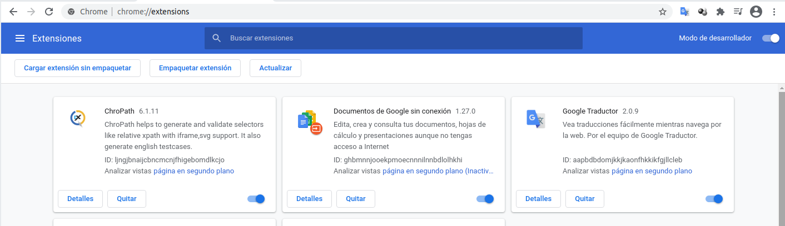  

- ## buscar la carpeta que descomprimio anteriormente y darle **Abrir** 

  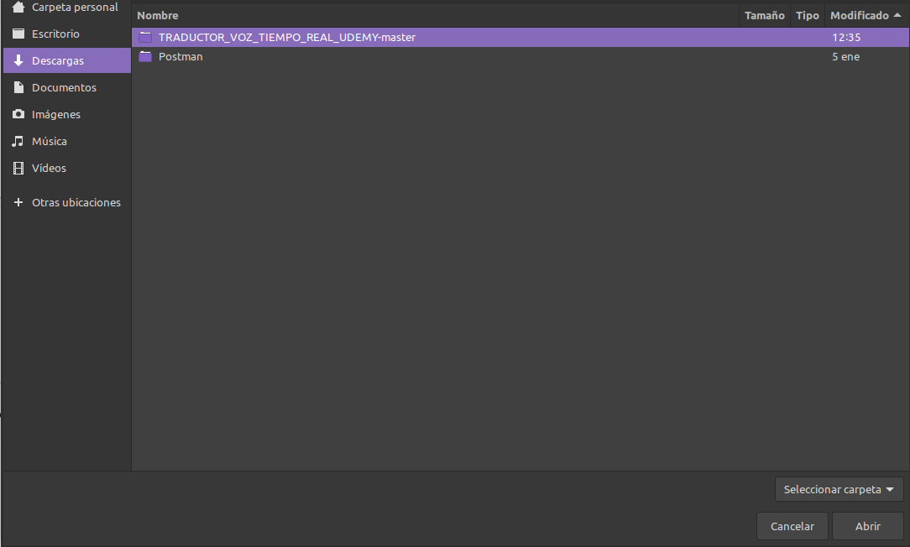  

  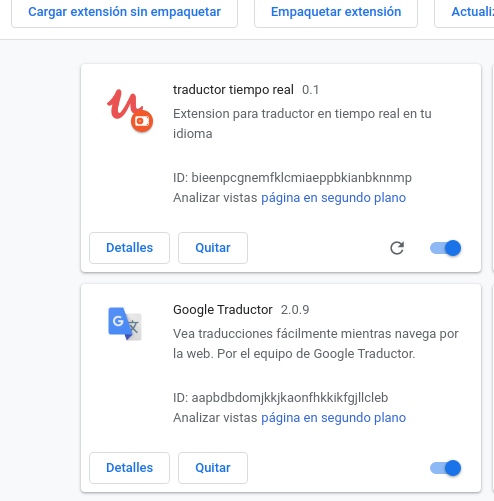  

- ## Su extension ya quedara instalada en su navegador chrome, le aconsego que ancle a su navegador dando click en **Extensiones** y dar click en **fijar**  

  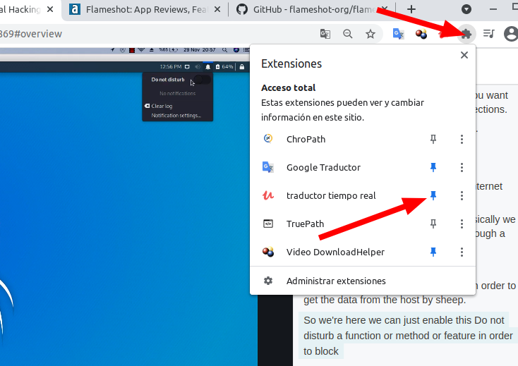  

# MODO DE USAR EN UDEMY

- ## En su curso de Udemy debe habiliar  la **Transcripción**

  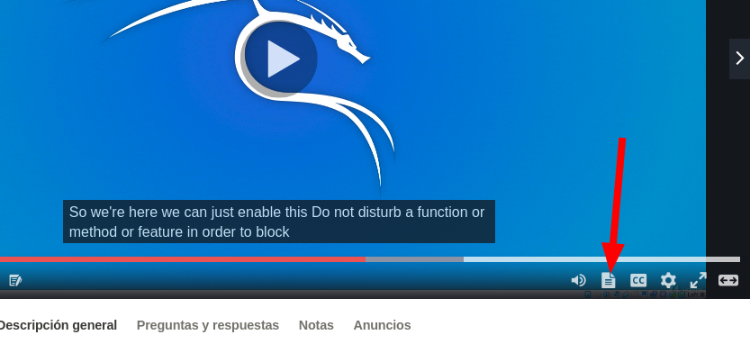  

- ## Tradusca la trancripcion a su idioma deseado con el traductor de google, dando click secundario en la trancripcion **traducir a español** por ejemplo (su extension de google debe configurarla a su idioma deseado)

  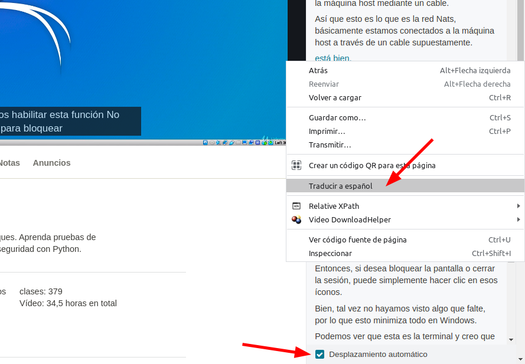  

- ## No olvide dejar el **Desplazamiento automatico**  habilitado

## y finalmente hacer click a su extension de **traducion de voz** que acabo de instalar en chrome 

  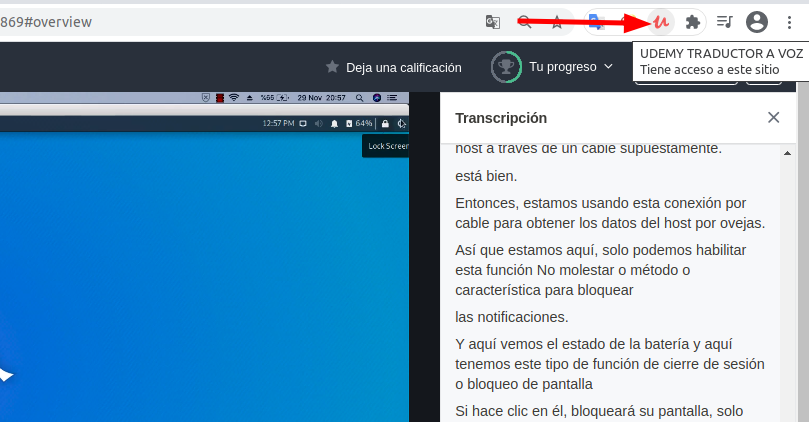  

# al dar click comensara a eschuchar la voz de google y su bot leera la trancripcion en tiempo real, puede pausar el video y para mejor experiencia puede bajar volumen o mute el video  y poner su video en pantalla completa,

## Si desea puede ver lo que lee el bot de google en su consola de navegador precionando **F12**  o dar click secundario en el navegador en **inspeccionar**

  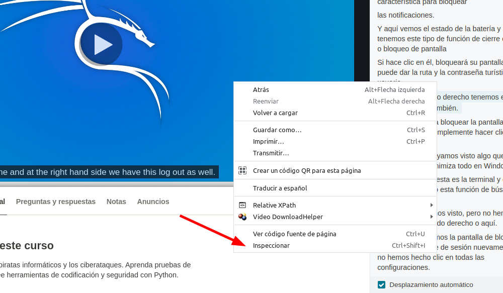  

  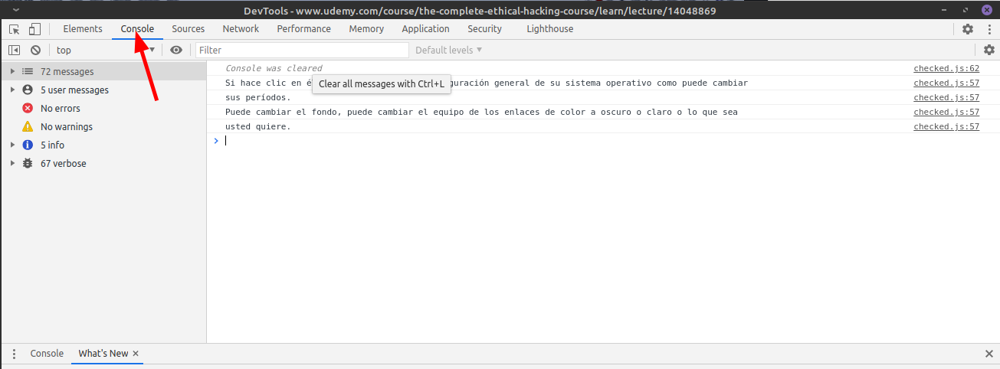  

# CAMBIAR DE IDIOMA DE VOZ

## Para cambiar el idioma de asento de Voz de google la Api de google nos ofrece los siguientes idiomas :
- ## 0 Google Deutsch true
- ## 1 Google US English 
- ## 2 Google UK English Female 
- ## 3 Google UK English Male 
- ## 4 Google español 
- ## 5 Google español de Estados Unidos 
- ## 11 Google 한국의 
- ## 12 Google Nederlands 
- ## 13 Google polski 
- ## 14 Google português do Brasil 
- ## 15 Google русский 
- ## 16 Google 普通话（中国大陆） 
- ## 17 Google 粤語（香港） 
- ## 18 Google 國語（臺灣）    
 
## Busque la carpeta que descomprimio de la extension  y en el archivo **checked.js**  abrablo con su editor de texto deseado y cambie la variable **`Google = `** con el numero de idioma que desee, guarde el archivo y actualize su extension o si desea quitela extension y vuelva a cargar su extension con la modificacion

  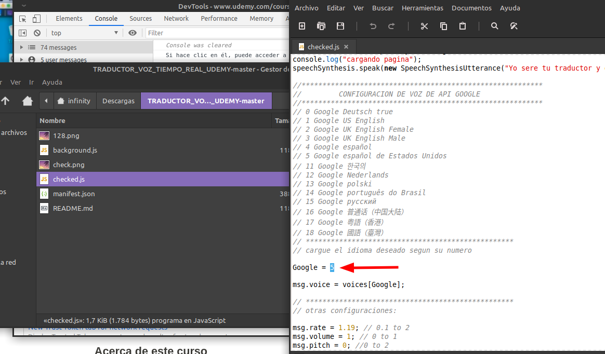  

# GRACIAS GRACIAS GRACIAS .... 
# Estoy sin trabajo. y si esta extension te sirvió en tu aprendisaje no olvides hacer tu donacion....   :)

## bitcoin: `32FkR97LHVmzHEr8LsbhkU29BnFqjHqwxC`

    

## Ethereum:  `0x2Fe79Eef40Ae5eA435c1A85B21E9112B2F2E646F ` 

  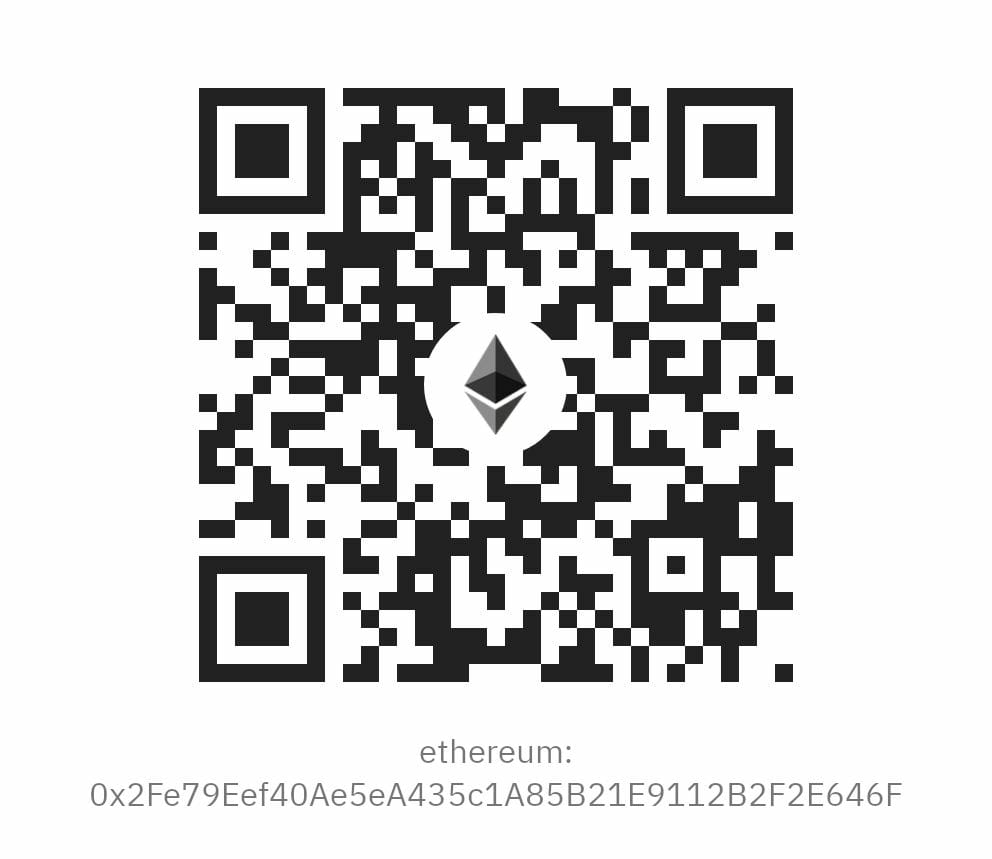  

## CardanoBEP2:    `bnb1dmlfkt8tpvuvsyzw78tdemutsmg4v2c4839h7d`

    

## Dai Stablecoin:  `0x2Fe79Eef40Ae5eA435c1A85B21E9112B2F2E646F?req-asset=0x6b175474e89094c44da98b954eedeac495271d0f`

  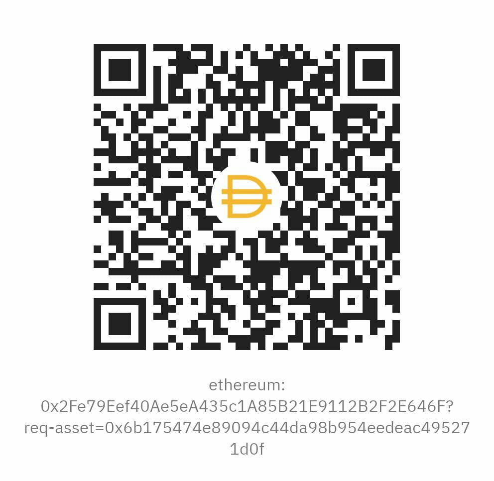  

## BNB:  `bnb1dmlfkt8tpvuvsyzw78tdemutsmg4v2c4839h7d`

    

## Dogecoin:  `D6RBcZoCmqxusiL8VUvbij2fvTHbbDt7Ce`

    

